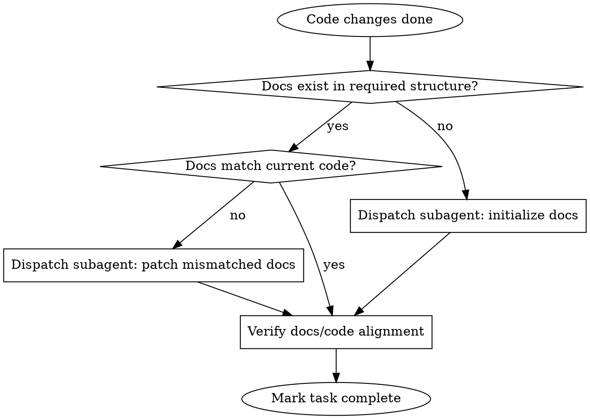

# Maintaining Docs Sync And Bootstrap

## Overview
Task completion is not done until docs match code. If docs are missing or stale, fix docs in the same workflow.

## When to Use
- Right before task completion
- Behavior, API, config, or module boundaries changed
- Symptoms: "tests pass but docs may be stale", "cannot find module docs", "repo has little or no docs"

## Decision Flow


## Required Docs Structure
- docs/architecture.md
- docs/knowledges/*.md
- docs/module/*.md

## Core Pattern
1. Before completion, check impacted docs against changed code and tests.
2. If docs exist but mismatch code: dispatch subagent to update docs precisely.
3. If docs structure is missing: dispatch subagent to initialize complete docs set.
4. Re-check docs/code alignment, then complete task.

## Quick Reference
| Situation | Action | Expected Result |
|---|---|---|
| Docs exist and match | Verify quickly | Safe to complete |
| Docs exist but mismatch | Subagent patches docs | Behavior/API docs match code |
| Docs missing | Subagent bootstraps structure | architecture + knowledges + module docs exist |

## Implementation
Mismatch repair prompt:

```text
Compare changed code and tests with docs. Update only mismatched sections.
Return exact doc paths and a short diff summary per file.
```

Bootstrap prompt:

```text
Use template at:
skills/maintaining-docs-sync-and-bootstrap/docs-bootstrap-subagent-template.md

Fill placeholders (<TASK_SUMMARY>, <SCOPE_PATHS_OR_MODULES>, <FILE_LIST>) and run the prompt as-is.
Return output in file-block format so files can be created directly.
```

## Baseline Failures Found In RED
- Docs update was treated as optional under exhaustion.
- Missing docs were deferred to "follow-up" instead of initialized.
- No mandatory subagent workflow for mismatch detection and repair.

## Rationalizations And Counters
| Excuse | Reality |
|---|---|
| "Tests are green, docs can wait" | Green tests do not guarantee user-facing correctness in docs. |
| "I'll open a docs ticket later" | Delayed docs drift becomes team-wide misinformation. |
| "No docs exists, too big to start now" | Bootstrap minimal complete docs now, iterate later. |

## Red Flags - Stop And Run Docs Workflow
- "Ship first, document later"
- "Only code changed, not behavior"
- "I am too tired to check docs"

Any red flag means run mismatch/bootstrap subagent flow before completion.

## Common Mistakes
- Updating only one doc file while behavior changed across modules.
- Writing generic docs without citing source code/test files.
- Completing task without final docs/code alignment check.
