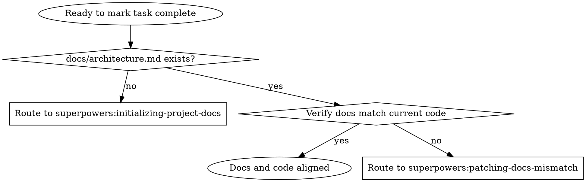

# Maintaining Docs Sync

## Overview
Before marking task complete, verify docs and code are aligned. This skill checks alignment and routes mismatches to the patching skill. It does not initialize missing docs nor patch mismatches itself.

## When to Use
- Right before marking task complete
- After implementation with potential behavior, API, or config changes
- docs/architecture.md already exists
- Need to verify alignment before closing task
- Symptoms: "tests pass, time to check docs", "unsure if docs match new code"

Do not use this skill for first-time docs bootstrap (use superpowers:initializing-project-docs).
Do not use this skill to patch mismatches (use superpowers:patching-docs-mismatch).
If docs/architecture.md is missing, stop and ask user to invoke superpowers:initializing-project-docs.

## Decision Flow


## Required Docs Structure
- docs/architecture.md
- docs/design/*.md
- docs/modules/*.md
- docs/knowledge/*.md

## Core Pattern
1. Before task completion, check impacted docs against changed code and tests.
2. If docs/architecture.md is missing: stop and route to superpowers:initializing-project-docs.
3. If docs and code align: proceed to mark task complete.
4. If docs and code mismatch: stop and route to superpowers:patching-docs-mismatch.
   - Do not attempt to patch in this skill.
   - Let patching skill handle the fix with appropriate subagent strategy.
   - After patching skill completes, re-check alignment once more.

## Quick Reference
| Situation | Action | Expected Result |
|---|---|---|
| Docs exist and match code | Proceed with task completion | Safe to close |
| Docs exist but mismatch | Route to patching-docs-mismatch skill | Mismatch will be fixed by patching skill |
| docs/architecture.md missing | Route to initializing-project-docs skill | Bootstrap happens first |
| Task blocked by init/patch skill | Wait for user/subagent completion | Re-check alignment after |

## Important: Skill Routing Boundaries
- **Check only:** This skill determines alignment status.
- **Patch:** Use superpowers:patching-docs-mismatch to fix mismatches.
- **Initialize:** Use superpowers:initializing-project-docs for missing docs.
- **Do NOT patch from this skill.** Stop and route instead.

## Implementation
Alignment check checklist:

```text
1) Identify all code/test files changed in this task.
2) Map each change to impacted docs paths (architecture / design / modules / knowledge).
3) For each impacted docs file:
   a) Read the current docs section.
   b) Read the corresponding changed code.
   c) Compare: does docs describe current code behavior accurately?
4) Summarize alignment status:
   - Fully aligned: proceed to completion.
   - Mismatched: stop and route to superpowers:patching-docs-mismatch.
```

## Baseline Failures Found In RED
- Sync (check) and patch were mixed, delaying clear scope.
- Checking and fixing in one skill prevented parallel patching.
- Check-only flow was unclear, leading to attempts to patch inline.

## Rationalizations And Counters
| Excuse | Reality |
|---|---|
| "Tests are green, docs can wait" | Green tests do not guarantee user-facing correctness in docs. |
| "I'll open a docs ticket later" | Delayed docs drift becomes team-wide misinformation. |
| "I should run init inside this skill" | Keep concerns separated: use initializing-project-docs for bootstrap. |

## Red Flags - Stop And Route Correctly
- "I'll just quickly fix the docs myself"
- "This mismatch looks simple, no need for the patching skill"
- "Let me combine check and fix in one go"

Any red flag means stop, identify what's needed (check? patch? init?), and use correct skill.

## Common Mistakes
- Attempting to edit docs from this skill (wrong skill: use superpowers:patching-docs-mismatch).
- Assuming alignment without checking all impacted doc paths.
- Skipping check because "docs look fine" - actually read and compare.
- Not routing to other skills when missing docs or mismatches found.
- Completing task without confirming alignment via this skill gate.

## Related Skills
- **Routing: If mismatch found:** Use superpowers:patching-docs-mismatch to fix
- **Routing: If docs/architecture.md missing:** Use superpowers:initializing-project-docs to bootstrap
- **Checkpoint in completion flow:** This skill gates task completion; it checks and routes rather than modifies
