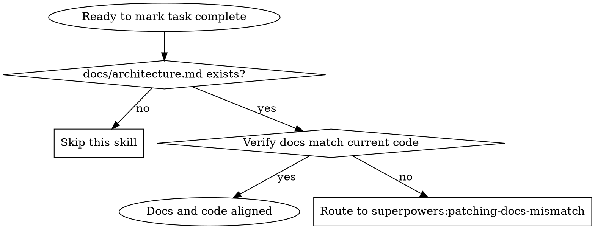

# Maintaining Docs Sync

## Overview
Before marking task complete, verify docs and code are aligned. This skill checks alignment and routes mismatches to the patching skill. It does not initialize missing docs nor patch mismatches itself.

Core principle: alignment includes behavior accuracy and scalable structure. If docs become too coupled, route to split-expansion patching. Do not treat trimming as a valid sync strategy.

## When to Use
- Right before marking task complete
- After implementation with potential behavior, API, or config changes
- docs/architecture.md already exists
- Need to verify alignment before closing task
- Symptoms: "tests pass, time to check docs", "unsure if docs match new code"

Do not use this skill for first-time docs bootstrap unless the user explicitly asks to create docs.
Do not use this skill to patch mismatches (use superpowers:patching-docs-mismatch).
If docs/architecture.md is missing, skip this skill.

## Decision Flow

```dot
digraph docs_sync_check_flow {
    rankdir=TB;
    start [label="Ready to mark task complete", shape=ellipse];
    check [label="docs/architecture.md exists?", shape=diamond];
   missing [label="Skip this skill", shape=box];
    verify [label="Verify docs match current code", shape=diamond];
    aligned [label="Docs and code aligned", shape=ellipse];
    mismatch [label="Route to superpowers:patching-docs-mismatch", shape=box];

    start -> check;
    check -> missing [label="no"];
    check -> verify [label="yes"];
    verify -> aligned [label="yes"];
    verify -> mismatch [label="no"];
}
```

## Required Docs Structure
- docs/architecture.md
- docs/design/*.md
- docs/modules/*.md
- docs/knowledge/*.md

Split-expansion shape (when needed):
- docs/modules/<module>.md plus docs/modules/<module>-<component>.md
- docs/design/<topic>.md plus docs/design/<topic>-<subdomain>.md

## Core Pattern
1. Before task completion, check impacted docs against changed code and tests.
2. If docs/architecture.md is missing: skip this skill.
3. If docs and code align structurally and behaviorally: proceed to mark task complete.
4. If docs and code mismatch (including module/design overgrowth or detail-loss during cleanup): stop and route to superpowers:patching-docs-mismatch.
   - Do not attempt to patch in this skill.
   - Let patching skill handle the fix with appropriate subagent strategy.
   - After patching skill completes, re-check alignment once more.

## Quick Reference
| Situation | Action | Expected Result |
|---|---|---|
| Docs exist and match code | Proceed with task completion | Safe to close |
| Docs exist but mismatch | Route to patching-docs-mismatch skill | Mismatch will be fixed by patching skill |
| Docs are behavior-accurate but module files became catch-all/monolithic | Route to patching-docs-mismatch skill | Structure drift is corrected before completion |
| Docs are behavior-accurate but design files became catch-all/monolithic | Route to patching-docs-mismatch skill | Design structure drift is corrected before completion |
| Docs were "cleaned up" by dropping details instead of splitting | Route to patching-docs-mismatch skill | Lost details are restored and redistributed |
| docs/architecture.md missing | Skip this skill | No docs-sync check is required |
| Task blocked by init/patch skill | Wait for user/subagent completion | Re-check alignment after |

## Important: Skill Routing Boundaries
- **Check only:** This skill determines alignment status.
- **Patch:** Use superpowers:patching-docs-mismatch to fix mismatches.
- **No docs:** Skip this skill.
- **Do NOT patch from this skill.** Stop and route instead.

## Implementation
Alignment check checklist:

```text
1) Identify all code/test files changed in this task.
2) Map each change to impacted docs paths (architecture / design / modules / knowledge).
3) For each impacted docs file:
   a) Read the current docs section.
   b) Read the corresponding changed code.
   c) Compare: does docs describe current code behavior accurately?
   d) Check structure quality:
      - are module docs coupling deep details for multiple independent components?
      - are design docs coupling deep details for multiple independent subdomains?
   e) Check preservation quality:
      - was detail relocated and linked during split, or removed during cleanup?
4) Summarize alignment status:
   - Fully aligned: proceed to completion.
   - Mismatched (behavioral or structural): stop and route to superpowers:patching-docs-mismatch.
```

## Baseline Failures Found In RED
- Sync (check) and patch were mixed, delaying clear scope.
- Checking and fixing in one skill prevented parallel patching.
- Check-only flow was unclear, leading to attempts to patch inline.

## Rationalizations And Counters
| Excuse | Reality |
|---|---|
| "Tests are green, docs can wait" | Green tests do not guarantee user-facing correctness in docs. |
| "I'll open a docs ticket later" | Delayed docs drift becomes team-wide misinformation. |
| "I should run init inside this skill" | This skill is check-only; if docs are missing, skip it. |
| "Docs are too long, just trim sections" | Trimming can create silent knowledge loss; route to split-expansion patching instead. |

## Red Flags - Stop And Route Correctly
- "I'll just quickly fix the docs myself"
- "This mismatch looks simple, no need for the patching skill"
- "Let me combine check and fix in one go"

Any red flag means stop, identify what's needed (check? patch? init?), and use correct skill.

## Common Mistakes
- Attempting to edit docs from this skill (wrong skill: use superpowers:patching-docs-mismatch).
- Assuming alignment without checking all impacted doc paths.
- Skipping check because "docs look fine" - actually read and compare.
- Trying to route missing-docs cases instead of skipping this skill.
- Not routing to patching-docs-mismatch when mismatch exists.
- Treating oversized catch-all module docs as acceptable because behavior is technically correct.
- Treating oversized catch-all design docs as acceptable because behavior is technically correct.
- Accepting detail loss caused by "cleanup" edits that did not relocate content.
- Completing task without confirming alignment via this skill gate.

## Related Skills
- **Routing: If mismatch found:** Use superpowers:patching-docs-mismatch to fix
- **Routing: If docs/architecture.md missing:** Skip this skill
- **Checkpoint in completion flow:** This skill gates task completion; it checks and routes rather than modifies
