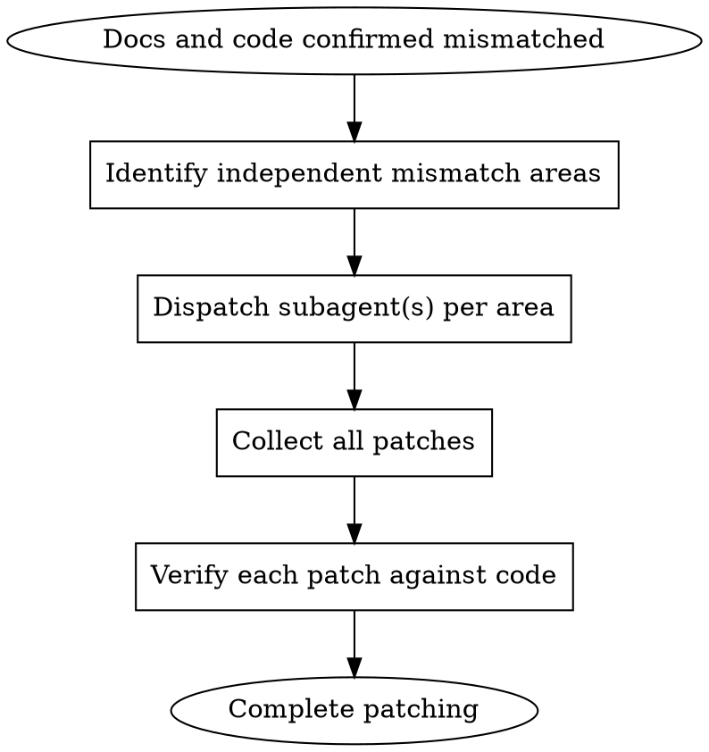

# Patching Docs Mismatch

## Overview
When code changes create docs-code drift, patch the mismatch precisely and efficiently using subagents for parallel problem isolation and focused fixes.

## When to Use
- docs/design/architecture.md exists (prerequisite gate)
- Implementation has changed behavior, APIs, or config
- Docs and code are confirmed mismatched
- **REQUIRED: Always use subagent dispatch** regardless of patch scope
- Symptoms: "tests pass but docs mention old behavior", "API docs look outdated", "feature change not documented"

Do not use this skill for initialization. Use superpowers:initializing-project-docs for first-time bootstrap.
Do not use if docs/design/architecture.md is missing.
Do not use superpowers:maintaining-docs-sync instead; that skill only checks alignment, this skill patches it.

## Decision Flow


## Core Pattern
1. Identify all independent mismatch areas (docs sections that diverged from changed code).
2. For each independent area, create a focused subagent task.
   - Each subagent fixes one isolated mismatch area.
   - Each outputs exact changed doc paths and diff summary.
   - No subagent overlaps on same doc file.
3. Dispatch all subagents in parallel (use superpowers:dispatching-parallel-agents if 2+).
4. Collect all patch results and verify each against changed code.
5. Ensure full alignment before returning control to task completion gate.

**No exceptions:** Always dispatch subagent(s). Never patch directly in main session.

## Quick Reference
| Scenario | Action | Tool | Expected Result |
|---|---|---|---|
| Single mismatch area | Dispatch one subagent | Current session subagent | Patch returned and verified |
| Multiple independent mismatches | Dispatch multiple subagents | superpowers:dispatching-parallel-agents | All patches collected and verified |
| Context constraints | Sequential dispatch + collect | Current session coordination | All mismatches patched, context preserved |

## Implementation
Subagent dispatch checklist (mandatory for all patches):

```text
REQUIRED SUB-SKILL: Use superpowers:dispatching-parallel-agents

For each independent mismatch area:
- Create subagent prompt specifying exact code changes, impacted docs, and mismatch details.
- Require subagent to return: patch summary, changed doc paths, before/after snippet.
- Ensure no two subagents touch the same doc file.

After all subagents return:
- Collect all patches.
- Verify each patch against source code once more.
- Ensure docs/design/architecture.md central theme consistency across all patches.
- Mark completion only when all patches verified.
```

Subagent prompt template (for complex multi-area patches):

```text
You are a docs-patching subagent.

Context: Implementation has changed [AREA], causing docs-code drift in:
- docs/knowledge/[specific-doc].md
- docs/module/[specific-module].md
- Other impacted paths: [LIST]

Changed code files: [LIST WITH LINE RANGES]
Current docs excerpts: [PASTE MISMATCHED SECTIONS]

Task: Patch only these docs to match current code.

Requirements:
1) Edit only the mismatched sections (no rewrite of entire doc).
2) Maintain existing structure and style.
3) Every claim requires evidence from changed code files (cite line numbers).
4) Do not expand scope beyond the listed impacted paths.
5) Return exact snippet before/after for each change.
6) Do not edit docs/design/architecture.md (leave for main session integration).

Output format:
=== Patch Summary ===
<one-line summary>

=== Before/After Diffs ===
File: docs/knowledge/[name].md
Before: [3-5 lines]
After: [3-5 lines]
Reason: [why this change was needed]

File: docs/module/[name].md
Before: [3-5 lines]
After: [3-5 lines]
Reason: [why this change was needed]

=== Verification ===
- Changed code reference: [file:lines]
- Docs now match code: yes/no
- Remaining concerns: [if any]
```

## Example: Patching After Config API Change

**Scenario:** Changed config loading from YAML to TOML; docs are outdated.

**Step 1 - Identify Mismatches:**
- `docs/module/config-loader.md` → References old YAML parsing
- `docs/knowledge/config-formats.md` → Lists YAML as primary format

**Step 2 - Dispatch Subagents:**

Subagent A: Fix config-loader.md
- Prompt: "Code changed to read TOML instead of YAML. Update docs/module/config-loader.md to match actual implementation."
- Code reference: `src/config-loader.ts:42-78` (TOML parsing logic)

Subagent B: Fix config-formats.md
- Prompt: "Config format changed from YAML to TOML. Update docs/knowledge/config-formats.md."
- Code reference: `src/config-loader.ts:1-40` (format handling)

**Step 3 - Collect Patches:**

Subagent A returns:
```
=== Patch Summary ===
Updated YAML references → TOML references in config-loader.md

=== Before/After ===
Before: "Loads YAML configuration files"
After: "Loads TOML configuration files"
Reason: Implementation changed to use TOML parsing (src/config-loader.ts:42)
```

Subagent B returns:
```
=== Patch Summary ===
Updated primary format designation in config-formats.md

=== Before/After ===
Before: "Primary format: YAML (YAML 1.2 spec)"
After: "Primary format: TOML (TOML v1.0.0 spec)"
Reason: Code migrated from YAML to TOML (src/config-loader.ts:1-40)
```

**Step 4 - Verify & Complete:**
- ✅ No overlapping edits (A: config-loader.md, B: config-formats.md)
- ✅ Both changes backed by code evidence
- ✅ docs/design/architecture.md not modified (left for main session)
- Task marked complete

**Result:** Parallel patching prevents bottlenecks; subagent evidence trail maintains credibility.

## Baseline Failures Found In RED
- Patch operation was mixed with sync check, delaying clear scope definition.
- No parallelization option for multi-area mismatches, causing sequential bottleneck.
- Subagent prompts lacked evidence requirements, resulting in generic docs without code grounding.

## Rationalizations And Counters
| Excuse | Reality |
|---|---|
| "Single line changed, I can edit directly" | No direct edits. Must dispatch subagent even for single-line patches. |
| "Subagents are overkill for tiny changes" | Subagent ensures evidence grounding and audit trail; always required. |
| "I'll patch design.md too" | Leave design synthesis to main session; subagents handle leaf docs only. |
| "tests pass, docs close enough" | Close is drift; patch for precision and user-facing correctness. |

## Red Flags - Stop And Re-run
- "I'll just fix this one line directly"
- "This is just a minor tweak, skip subagent dispatch"
- "Let subagents handle everything, I won't verify"
- "Subagent dispatch is too slow"

Any red flag means: Stop. Dispatch subagent immediately. Verify all patches before completion. No exceptions.

## Common Mistakes
- Editing docs/design/architecture.md from this skill instead of leaving to main session.
- Not verifying each subagent patch against actual code line-by-line.
- Letting multiple subagents edit overlapping doc sections.
- Skipping final pass that re-reads code and all patched docs together.
- Using this skill when docs/design/architecture.md is missing (wrong skill: use superpowers:initializing-project-docs).
- Sending subagents with vague scope instead of exact code diffs and impacted doc paths.

## Related Skills
- **REQUIRED SUB-SKILL:** superpowers:dispatching-parallel-agents (when patching multiple independent areas)
- **REQUIRED GATE BEFORE THIS:** superpowers:maintaining-docs-sync (to confirm mismatch exists)
- **ALTERNATIVE FOR BOOTSTRAP:** superpowers:initializing-project-docs (when docs/design/architecture.md missing)
