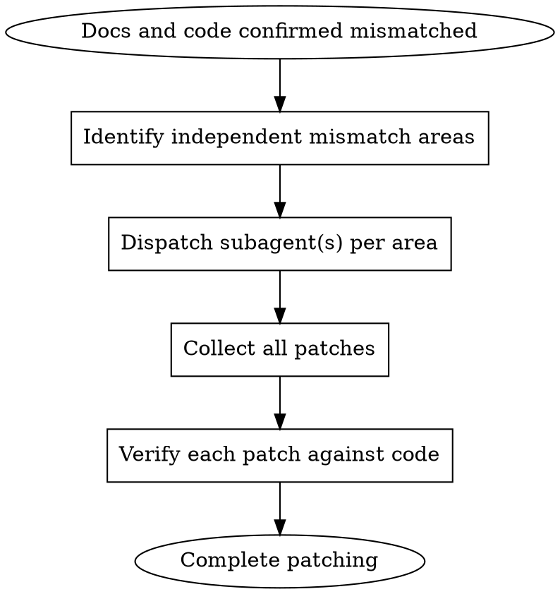

# Patching Docs Mismatch

## Overview
When code changes create docs-code drift, patch the mismatch precisely and efficiently using subagents for parallel problem isolation and focused fixes.

Core principle: structural patching means redistribute depth across multiple docs, not reduce depth. Split for scale while preserving and improving detail.

## When to Use
- docs/architecture.md exists (prerequisite gate)
- Implementation has changed behavior, APIs, or config
- Docs and code are confirmed mismatched
- **REQUIRED: Always use subagent dispatch** regardless of patch scope
- Symptoms: "tests pass but docs mention old behavior", "API docs look outdated", "feature change not documented"

Do not use this skill for initialization tasks.
Skip this skill if docs/architecture.md is missing.
Do not use superpowers:maintaining-docs-sync instead; that skill only checks alignment, this skill patches it.

## Decision Flow

```dot
digraph patch_flow {
    rankdir=TB;
    start [label="Docs and code confirmed mismatched", shape=ellipse];
    scope [label="Identify independent mismatch areas", shape=box];
    dispatch [label="Dispatch subagent(s) per area", shape=box];
    collect [label="Collect all patches", shape=box];
    verify [label="Verify each patch against code", shape=box];
    done [label="Complete patching", shape=ellipse];

    start -> scope;
    scope -> dispatch;
    dispatch -> collect;
    collect -> verify;
    verify -> done;
}
```

## Core Pattern
1. Identify all independent mismatch areas (docs sections that diverged from changed code).
2. Classify mismatch type per area:
    - behavioral mismatch (docs statement wrong)
    - structural mismatch (module or design doc became a catch-all and should be split)
    - preservation mismatch (prior cleanup removed detail instead of relocating it)
3. For each independent area, create a focused subagent task.
   - Each subagent fixes one isolated mismatch area.
   - Each outputs exact changed doc paths and diff summary.
   - No subagent overlaps on same doc file.
    - For structural mismatches, subagent must split into multiple module and/or design docs as needed.
    - For preservation mismatches, subagent must restore missing detail and relocate it with explicit links.
4. Dispatch all subagents in parallel (use superpowers:dispatching-parallel-agents if 2+).
5. Collect all patch results and verify each against changed code.
6. Ensure full alignment before returning control to task completion gate.

**No exceptions:** Always dispatch subagent(s). Never patch directly in main session.

## Quick Reference
| Scenario | Action | Tool | Expected Result |
|---|---|---|---|
| Single mismatch area | Dispatch one subagent | Current session subagent | Patch returned and verified |
| Multiple independent mismatches | Dispatch multiple subagents | superpowers:dispatching-parallel-agents | All patches collected and verified |
| Module doc became monolithic | Dispatch split-focused subagent | Current session subagent or parallel set | Deep details redistributed across multiple module/design docs |
| Design doc became monolithic | Dispatch split-focused subagent | Current session subagent or parallel set | Deep design subdomains redistributed across multiple design docs |
| Detail was trimmed during cleanup | Dispatch restoration subagent | Current session subagent | Lost detail restored and linked into split docs |
| Context constraints | Sequential dispatch + collect | Current session coordination | All mismatches patched, context preserved |

## Implementation
Subagent dispatch checklist (mandatory for all patches):

```text
REQUIRED SUB-SKILL: Use superpowers:dispatching-parallel-agents

For each independent mismatch area:
- Create subagent prompt specifying exact code changes, impacted docs, and mismatch details.
- Require subagent to return: patch summary, changed doc paths, before/after snippet.
- Ensure no two subagents touch the same doc file.
- If mismatch is structural, require split-expansion map: what remains in parent doc vs what moves to split module/design docs.
- If mismatch is preservation-related, require restoration map: what detail was missing and where it is restored.

After all subagents return:
- Collect all patches.
- Verify each patch against source code once more.
- Verify split docs preserve or deepen previous detail coverage.
- Verify parent docs link to all split docs and no orphan sections remain.
- Ensure docs/architecture.md central theme consistency across all patches.
- Mark completion only when all patches verified.
```

Subagent prompt template (for complex multi-area patches):

```text
You are a docs-patching subagent.

Context: Implementation has changed [AREA], causing docs-code drift in:
- docs/design/[specific-design].md
- docs/modules/[specific-module].md
- docs/knowledge/[specific-topic].md
- Other impacted paths: [LIST]

Changed code files: [LIST WITH LINE RANGES]
Current docs excerpts: [PASTE MISMATCHED SECTIONS]

Task: Patch only these docs to match current code.

Requirements:
1) Edit only the mismatched sections (no rewrite of entire doc).
2) Maintain existing structure and style.
3) Every claim requires evidence from changed code files (cite line numbers).
4) Do not expand scope beyond the listed impacted paths.
5) Return exact snippet before/after for each change.
6) Write documentation narrative in English; allow non-English text only for quoted source material.
7) Do not edit docs/architecture.md (leave for main session integration).
8) If module/design file is overstuffed, split into multiple module/design docs by independent concerns.
9) Do not trim details to force brevity; preserve and relocate depth with links.

Output format:
=== Patch Summary ===
<one-line summary>

=== Before/After Diffs ===
File: docs/design/[name].md
Before: [3-5 lines]
After: [3-5 lines]
Reason: [why this change was needed]

File: docs/modules/[name].md
Before: [3-5 lines]
After: [3-5 lines]
Reason: [why this change was needed]

File: docs/knowledge/[name].md
Before: [3-5 lines]
After: [3-5 lines]
Reason: [why this change was needed]

=== Verification ===
- Changed code reference: [file:lines]
- Docs now match code: yes/no
- Detail preserved or expanded: yes/no
- Split-expansion map complete: yes/no
- Remaining concerns: [if any]
```

## Baseline Failures Found In RED
- Patch operation was mixed with sync check, delaying clear scope definition.
- No parallelization option for multi-area mismatches, causing sequential bottleneck.
- Subagent prompts lacked evidence requirements, resulting in generic docs without code grounding.

## Rationalizations And Counters
| Excuse | Reality |
|---|---|
| "Single line changed, I can edit directly" | No direct edits. Must dispatch subagent even for single-line patches. |
| "Subagents are overkill for tiny changes" | Subagent ensures evidence grounding and audit trail; always required. |
| "I'll patch architecture.md too" | Leave architecture to main session; subagents handle leaf docs only. |
| "tests pass, docs close enough" | Close is drift; patch for precision and user-facing correctness. |
| "Reviewers want one-file docs, so keep adding to module file" | Use parent-doc navigation plus split docs; do not keep deep multi-concern content in one file. |
| "To split faster, cut details" | Split patching must preserve or increase detail; cutting detail creates preservation mismatch. |

## Red Flags - Stop And Re-run
- "I'll just fix this one line directly"
- "This is just a minor tweak, skip subagent dispatch"
- "Let subagents handle everything, I won't verify"
- "Subagent dispatch is too slow"

Any red flag means: Stop. Dispatch subagent immediately. Verify all patches before completion. No exceptions.

## Common Mistakes
- Editing docs/architecture.md from this skill instead of leaving to main session.
- Not verifying each subagent patch against actual code line-by-line.
- Letting multiple subagents edit overlapping doc sections.
- Skipping final pass that re-reads code and all patched docs together.
- Using this skill when docs/architecture.md is missing (should be skipped).
- Sending subagents with vague scope instead of exact code diffs and impacted doc paths.
- Preserving a module/design mega-file by appending more sections instead of split-expansion.
- Shrinking docs by deleting deep sections without restoration map.

## Related Skills
- **REQUIRED SUB-SKILL:** superpowers:dispatching-parallel-agents (when patching multiple independent areas)
- **REQUIRED GATE BEFORE THIS:** superpowers:maintaining-docs-sync (to confirm mismatch exists)
- **ALTERNATIVE IF USER EXPLICITLY REQUESTS DOC CREATION:** superpowers:initializing-project-docs
